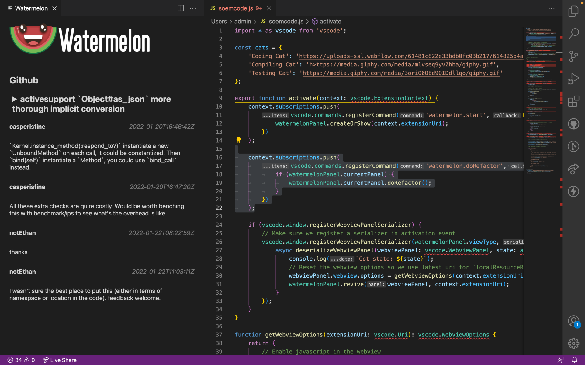

Watermelon is an IDE extension that brings in answers of _why_ a piece of code was written.

We take the Github PR comments, Slack chats, and Jira statements to give you in plain English all the context.

To run Watermelon, you'll need VS Code.
