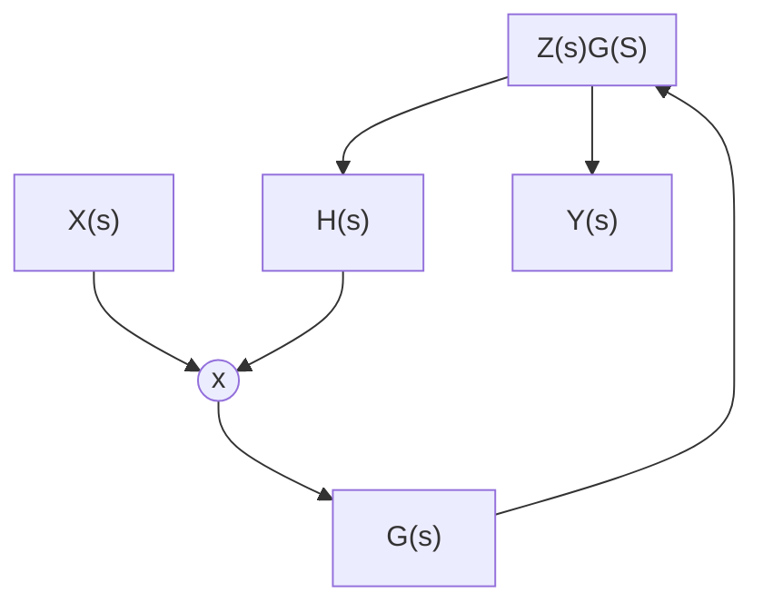

## The cool git: 1. Git Bisect

**TL;DR:** Use binary search to find the commit that introduced a bug.

**For humans:** Take 2 commits and start removing halves until you find the error.

The command `git blame` has been my ally in those times that the bug is a mistery. It has allowed me to go back in history and see the commit that broke something. Usually it's me being a detective for my own murder.

As simple as it sounds, it takes a "correct" commit and a boken one and with binary search, it allows you to find the offending one _fast_.

