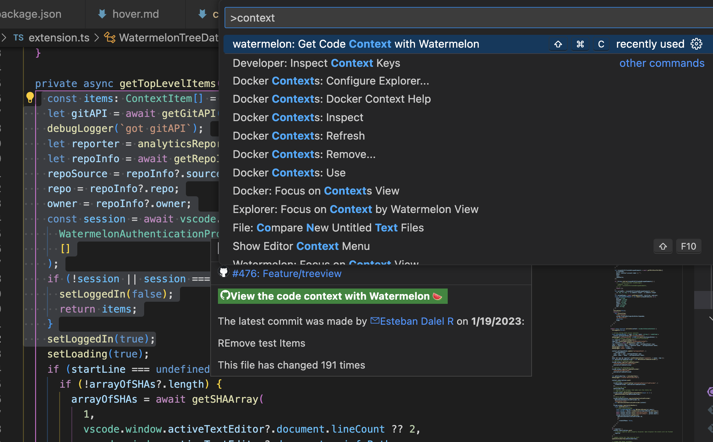

# Code Context with the Command Palette

Select text with your keyboard, and press `Ctrl+Shift+P` (`Cmd+Shift+P` on Mac) to open the Command Palette, type "Get Code Context with Watermelon" and press Enter.

