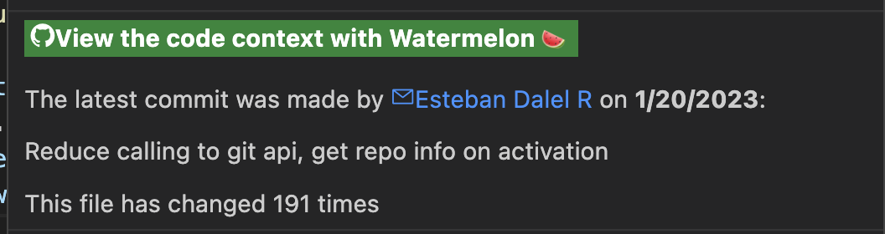

# The Watermelon Hover

Hover over code and wait for the panel to pop up.
The hover contains links to allow activating both the History and Pull Requests for the line hovered.
It shows the latest commit information:

- The commit message.
- The commit author.
- The commit date.

Lastly, it shows how many times the hovered file has changed, giving you an indication of how much work has been done on the file.

