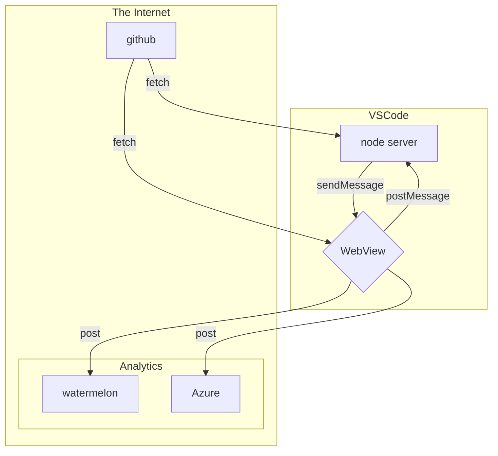

# Architecture

```mermaid
flowchart TD
    subgraph VSCode
    A[node server] --sendMessage--> B{WebView}
    B --postMessage--> A
    end
    subgraph The Internet
    direction BT
    C[github]
        subgraph Analytics
        D[watermelon]
        E[Azure]
        end
    end
    C --fetch--> A
    C -- fetch --> B
    B -- post --> D
    B -- post --> E
    
``` 
