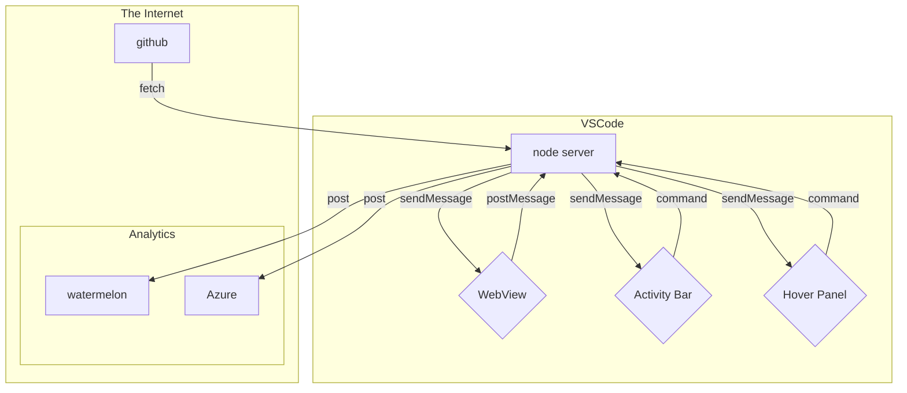

# Architecture

```mermaid
flowchart TD
    subgraph VSCode
    A[node server] --sendMessage--> B{WebView}
    B --postMessage--> A
    A[node server] --sendMessage--> F{Activity Bar}
    A[node server] --sendMessage--> G{Hover Panel}
    F --command--> A
    G --command--> A
    end
    subgraph The Internet
    direction BT
    C[github]
        subgraph Analytics
        D[watermelon]
        E[Azure]
        end
    end
    C --fetch--> A
    A -- post --> D
    A -- post --> E
    
``` 
