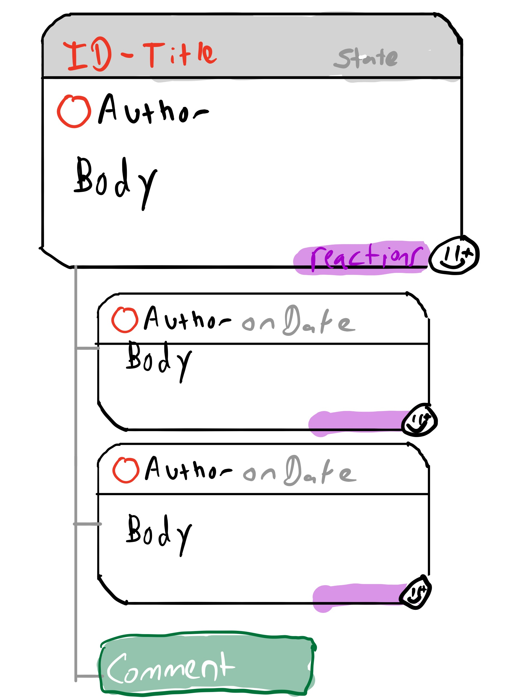

# Stable UI

After a lot of learnings, we can be proud that we have figured out what Watermelon will look like for the short and medium term. We have a stable UI that we can use to build the extension.

## What is the stable UI?

For this, we thought of all the possible integrations that will come in the future, and the broad categories of information that we will need to display. We also thought about the different ways to display this information, and the different ways to interact with it.

Here are some examples:

- Code Storage
  - GitHub
  - GitLab
  - BitBucket
- Ticketing
  - Jira
  - Trello
  - Asana
  - GitHub Projects
  - Linear
  - Notion
- Communication
  - Slack
  - Discord
  - Teams
  - Zoom
  - Google Meet
- Documentation
  - Confluence
  - Notion
  - Google Docs
  - Microsoft Docs
  - GitHub Wiki
- CRMs
  - Hubspot
  - Salesforce
  - Pipedrive
  - Zoho
- Analytics
  - Google Analytics
  - Mixpanel
  - Amplitude
  - Segment
- Bug Catching
  - Sentry
  - Datadog
- Deployments
  - Azure DevOps
  - GitHub Actions
  - GitLab CI
  - Vercel
  - Netlify
  - Heroku

## How do we display this information?

We have a lot of information to display, and we want to make it as easy as possible to access it. We also want to make it as easy as possible to add new integrations.

We have decided to use a sidebar that will be displayed on the IDE for the developer to stay on their workflow. When activated, it will display two main sections:

- The first, shows the contextual information found in the connected services. This section is inactive unless the developer asks for it.
- The second, shows the tasks assigned to the developer. This section is always active. This is currently the Daily Summary.

## How do we interact with this information?

For now, we a read only interface. Soon, we will add the possibility of interacting with the information. For example, we will be able to:

- Create a new ticket
- Create a new task
- Create a new meeting
- Create a new document
- Create a new note
- Create a new event
- Create a new lead
- Comment on a ticket
- Comment on a task
- Comment on a thread
- Comment on a document
- Add to a contact
- Add to a document
- React to a message

## Caveats

We want to limit the chances of distracting the developer. Just bringing in the full UI of the connected services would be a distraction. We want to limit the number of clicks to access the information and make it so the developer can do everything on the keyboard. This is a natural way to do so for developers.

## What's next?

The Proposed UI looks as follows, with the title and icon of the service:

